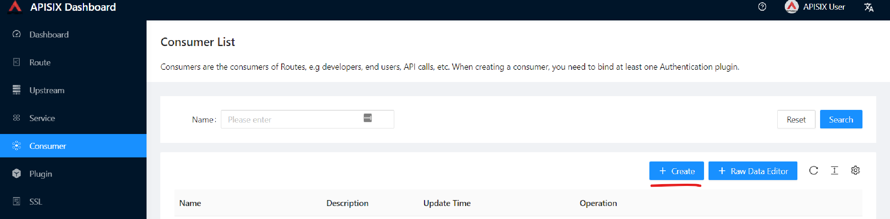

= Hands-on lab Apache APISIX
AsciiDoc article template
:toc:
:icons: font

== Welcome

Welcome to Hands-on lab https://apisix.apache.org/[Apache APISIX]!
In this session, we will use https://apisix.apache.org/docs/apisix/how-to-build[Apache APISIX on Docker] to show a couple of nifty features that can help your information system cope with the challenges introduced by APIs.

* Routing your calls to the correct upstream
* Available abstractions: Route, Upstream, Service
* The Apache APISIX dashboard
* Configuring APISIX with the dashboard
* Configuring APISIX with the command-line
* Monitoring APISIX
* Introduction to plugin development in Lua (basics of Lua included)

== Concepts

Some core concepts should be learned before you create some configurations to let Apache APISIX work as per your needs.

1. https://apisix.apache.org/docs/apisix/architecture-design/route/[Route] is the most important concept in Apache APISIX, it guides APISIX to forward traffic to the correct backends.
2. https://apisix.apache.org/docs/apisix/architecture-design/upstream/[Upstream] is the view of backend microservices from APISIX point of view.
3. https://apisix.apache.org/docs/apisix/architecture-design/plugin/[Plugin] is a mechanism to manage traffic ( authentication, authorization, and so on) on the APISIX side.

== Pre-requisites

* Installed https://www.docker.com/[Docker] and
https://docs.docker.com/compose/[Docker Compose] component.
* We use the https://curl.se/docs/manpage.html[curl] command for API
testing. You can also use other tools such as Postman for testing.

== Install Apache APISIX

Download the Docker image of Apache APISIXgit clone.

....
git clone https://github.com/apache/apisix-docker.git
....

Switch the current directory to the apisix-docker/example path.

....
cd apisix-docker/example
....

Run the docker-compose command to install Apache APISIX.

....
docker-compose -p docker-apisix up -d
....

Once the download is complete, execute the curl command on the host
running Docker to access the Admin API, and determine if Apache APISIX
was successfully started based on the returned data.

Please execute the curl command on the host where you are running
Docker.

....
curl "http://127.0.0.1:9080/apisix/admin/services/" -H 'X-API-KEY: edd1c9f034335f136f87ad84b625c8f1'
....

== Create a Route

Now we have a running instance of Apache APISIX. Next, let’s create a
Route.

=== How it works

We can create a
https://apisix.apache.org/docs/apisix/architecture-design/route/[Route]
and connect it to an
https://apisix.apache.org/docs/apisix/architecture-design/upstream/[Upstream]
service(also known as the Upstream). When a Request arrives at Apache
APISIX, Apache APISIX knows which Upstream the request should be
forwarded to.

=== Route Configuration

The following curl command creates a sample configuration of Route:

[source,text]
----
curl "http://127.0.0.1:9080/apisix/admin/routes/1" -H "X-API-KEY: edd1c9f034335f136f87ad84b625c8f1" -X PUT -d '
{
  "methods": ["GET"],
  "host": "example.com",
  "uri": "/anything/*",
  "upstream": {
    "type": "roundrobin",
    "nodes": {
      "httpbin.org:80": 1
    }
  }
}'
----

Once this route is created, we can access the Upstream service using the
address exposed by Apache APISIX.

....
curl -i -X GET "http://127.0.0.1:9080/anything/foo?arg=10" -H "Host: example.com"
....

This will be forwarded to http://httpbin.org:80/anything/foo?arg=10 by
Apache APISIX.

== Create an Upstream

An Upstream can be created by simply executing the following command:

[source,text]
....
curl "http://127.0.0.1:9080/apisix/admin/upstreams/1" -H "X-API-KEY: edd1c9f034335f136f87ad84b625c8f1" -X PUT -d '
{
  "type": "roundrobin",
  "nodes": {
    "httpbin.org:80": 1
  }
}'
....

NOTE: Creating an Upstream service is not actually necessary, as we can
use
https://apisix.apache.org/docs/apisix/architecture-design/plugin/[Plugin]
to intercept the request and then respond directly. However, for the
purposes of this guide, we assume that at least one Upstream service
needs to be set up.

== Bind the Route to the Upstream

In the above step, we created an Upstream service (referencing our
backend service), now let’s bind a Route for it.

[source,text]
....
curl "http://127.0.0.1:9080/apisix/admin/routes/1" -H "X-API-KEY: edd1c9f034335f136f87ad84b625c8f1" -X PUT -d '
{
  "uri": "/get",
  "host": "httpbin.org",
  "upstream_id": "1"
}'
....

=== Validation

We have created the route and the Upstream service and bound them. Now
let’s access Apache APISIX to test this route.

[source,shell script]
....
  curl -i -X GET "http://127.0.0.1:9080/get?foo1=bar1&foo2=bar2" -H "Host: httpbin.org"
....

It returns data from our Upstream service (actually httpbin.org) and the
result is as expected.

== APISIX Dashboard

__Apache APISIX__ provides a
https://github.com/apache/apisix-dashboard[Dashboard] to make our
operation more intuitive and easier on UI.

More information about APISIX Dashboard can be found https://apisix.apache.org/docs/dashboard/USER_GUIDE[here].

TIP: You can also watch you a video tutorial on YouTube https://youtu.be/-9-HZKK2ccI[Getting started with Apache APISIX Dashboard]. You can learn
how to use the APISIX dashboard platform to manage your Admin API from a single simple user interface. Also, how to install Apache APISIX with Docker, how you can create a route, upstream and add authentication to your first Consumer service using the same Dashboard. The same steps we do here.

=== Add a new Consumer

In the above steps, we created a new route, upstream and mapped the route to the upstream.

====
The same configuration we did via command-line interface can be achieved with the Dashboard.
====

.Here are some of the things you can do with APISIX Dashboard:

- Create new Routes, Upstreams and Consumers.
- Activate or deactivate plugins with a couple of clicks.

WARNING: The route we created is public. Thus, anyone can access this Upstream service as long as they know the address that Apache APISIX exposes to the outside world. This is unsafe, it creates certain security risks. In a practical application scenario, we need to add authentication to the route.

Apache APISIX dashboard is running on the address http://localhost:9000/
if you click and try to open the Apache APISIX dashboard you can see the dashboard is running

====
You can log into the dashboard by using *login* as _admin_ and *password* as an _admin_.
====
image::login-dashboard-screenshot.png[]

After you logged in, go to Route page in the navigation bar on the left side.

As you can see in the below image, there is a route in the Route list that we created previously with curl commands.

image::route-list-screenshot.png[]

Next, open Upstream page by navigating to Upstream option on the same bar.

Similarly, in the list of Upstreams, our example upstream is appeared.

image::upstream-list-screenshot.png[]

So let's create our first consumer I will press a button to create and give a consumer name in this case we can call it _Example Consumer_ so click next

image::consumer-detail-screenshot.png[]

And we will apply for this consumer the key auth, a key authentication and we need to enable from various plugins options I will choose authentication.

image::key-auth-plugin-enable-screenshot.png[]

Go to the Plugin Editor in order to enable this plugin I need to press enable button and click this toggle switch on
then I will just provide a key for the consumer like a key for example key of john and submit click next and submit.

image::plugin-config-example-screenshot.png[]

So now as you can see we have example consumer.

image::example-consumer-created-screenshot.png[]

====
By adding key authentication we are controlling the data that is allowed to be transmitted from our gateways and identifying unique consumers that are accessing our API now that the plugin is activated and any requests that do not include a valid API key will be automatically rejected with HTTP 401 status.
====
To show this let's move over to our terminal.

=== Enable key-auth plugin

To test this we can simply run following command:

....
curl -i -X GET "http://127.0.0.1:9080/anything/foo?arg=10" -H "Host: example.com"
....

We want to access with GET HTTP method with specified parameters the endpoint.

We will obviously get an unauthorized error now it's our API is secured, and we are missing API key

image::http-unauthorized-error-screenshot.png[]

And what we can do we need to send the API key.
So let's add to the end of my request API key of _Example Consumer_ and press enter.

....
curl -i -X GET http://127.0.0.1:9080/get -H "Host: httpbin.org" -H "apikey: key-of-john"
....

Now as you can see I can access my API endpoint.

image::access-endpoint-with-consumer.png[]

So far we have shown how you can use the power of Apache APISIX  to deploy configure and publish your API and secure
it as well all from a single user interface currently the dashboard.
