= Hands-on lab Apache APISIX
Bobur Umurzokov <boburmirzo.umurzokov@gmail.com>
:toc:
:icons: font
:experimental: true

== Welcome

Welcome to Hands-on lab https://apisix.apache.org/[Apache APISIX^]!
In this session, we will use https://apisix.apache.org/docs/apisix/how-to-build[Apache APISIX on Docker^] to show a couple of nifty features that can help your information system cope with the challenges introduced by APIs.

* Routing your calls to the correct upstream
* Available abstractions: Route, Upstream, Service
* The Apache APISIX dashboard
* Configuring APISIX with the dashboard
* Configuring APISIX with the command-line
* Monitoring APISIX
* Introduction to plugin development in Lua (basics of Lua included)

== Concepts

We should learn a couple of core concepts before Apache APISIX work as per our needs.

. https://apisix.apache.org/docs/apisix/architecture-design/route/[Route^] is the most critical concept in Apache APISIX; it instructs APISIX how to forward traffic to the correct upstream.
. https://apisix.apache.org/docs/apisix/architecture-design/upstream/[Upstream^] is the view of backend microservices from Apache APISIX point of view.
. https://apisix.apache.org/docs/apisix/architecture-design/plugin/[Plugin^] is a mechanism to manage traffic (authentication, authorization, and so on) on the APISIX side.

== Pre-requisites

* Installed https://www.docker.com/[Docker^] and https://docs.docker.com/compose/[Docker Compose^] component.
* We use the https://curl.se/docs/manpage.html[curl^] command for API testing.
You can also use other tools such as Postman for testing.

== Install Apache APISIX

Download the Docker image of Apache APISIX.

[source,bash^]
----
git clone https://github.com/apache/apisix-docker.git
----

Switch the current directory to the apisix-docker/example path.

[source,bash^]
----
cd apisix-docker/example
----

Run the docker-compose command to install Apache APISIX.

[source,bash]
----
docker-compose -p docker-apisix up -d
----

Once the download is complete, execute the curl command on the host running Docker to access the Admin API, and determine if Apache APISIX was successfully started based on the returned data.

Please execute the curl command on the host where you are running
Docker.

[source,bash]
----
curl "http://127.0.0.1:9080/apisix/admin/services/" -H 'X-API-KEY: edd1c9f034335f136f87ad84b625c8f1'
----

== Create a Route

Now we have a running instance of Apache APISIX. Next, let’s create a
Route.

=== How it works

We can create a https://apisix.apache.org/docs/apisix/architecture-design/route/[Route^] and connect it to an https://apisix.apache.org/docs/apisix/architecture-design/upstream/[Upstream^].
When Apache APISIX receives a request, it computes which Upstream it should forward it.

=== Route Configuration

The following curl command creates a sample configuration of Route:

[source,bash]
----
curl "http://127.0.0.1:9080/apisix/admin/routes/1" -H "X-API-KEY: edd1c9f034335f136f87ad84b625c8f1" -X PUT -d '
{
  "methods": ["GET"],
  "host": "example.com",
  "uri": "/anything/*",
  "upstream": {
    "type": "roundrobin",
    "nodes": {
      "httpbin.org:80": 1
    }
  }
}'
----

Once we have created the Route, we can access the Upstream through the Apache APISIX.

[source,bash]
----
curl -i -X GET "http://127.0.0.1:9080/anything/foo?arg=10" -H "Host: example.com"
----

Apache APISIX will forward the request to http://httpbin.org:80/anything/foo?arg=10.

== Create an Upstream

Apache APISIX API is consistent.
The Upstream API is similar to the Route's.
We can create an Upstream by executing the following command:

[source,bash]
----
curl "http://127.0.0.1:9080/apisix/admin/upstreams/1" -H "X-API-KEY: edd1c9f034335f136f87ad84b625c8f1" -X PUT -d '
{
  "type": "roundrobin",
  "nodes": {
    "httpbin.org:80": 1
  }
}'
----

== Bind the Route to the Upstream

In the above section, we created an Upstream (referencing our backend);
now, let's bind a Route for it.

[source,bash]
----
curl "http://127.0.0.1:9080/apisix/admin/routes/1" -H "X-API-KEY: edd1c9f034335f136f87ad84b625c8f1" -X PUT -d '
{
  "uri": "/get",
  "host": "httpbin.org",
  "upstream_id": "1"
}'
----

=== Validation

At this point, we have created a Route and an Upstream and bound them together.
Now is time to test our configuration.

[source,bash]
----
curl -i -X GET "http://127.0.0.1:9080/get?foo1=bar1&foo2=bar2" -H "Host: httpbin.org"
----

It should return the expected data from the configured Upstream.

== APISIX Dashboard

Apache APISIX provides a https://github.com/apache/apisix-dashboard[Dashboard^] to make operating it more intuitive and more accessible.

You can find more information about APISIX Dashboard in the https://apisix.apache.org/docs/dashboard/USER_GUIDE[user guide^].

[TIP]
====
A https://youtu.be/-9-HZKK2ccI[Getting started with Apache APISIX Dashboard^] video tutorial is available.
It demos the same features we achieve here via the +++<abbr title="Command-Line Interface">CLI</abbr>+++.
====

=== Add a new Consumer

We created a new Route, Upstream, and mapped the former to the latter in the above steps.

[NOTE]
====
We can achieve the same configuration result with the +++<abbr title="Command-Line Interface">CLI</abbr>+++ as with the Dashboard.
Indeed, the Dashboard sends HTTP requests to Apache APISIX.
====

The Route we have created is public.
Thus, anyone can access the underlying Upstream as long as they know the endpoint Apache APISIX exposes to the outside world.
It's not safe as a malicious actor could use this endpoint.
For this reason, we are going to add authentication to the Route.

Apache APISIX dashboard is running on the address http://localhost:9000/.
You can navigate to this address and see the Dashboard running.

The default credentials are `admin`/`admin`.

[.text-center]
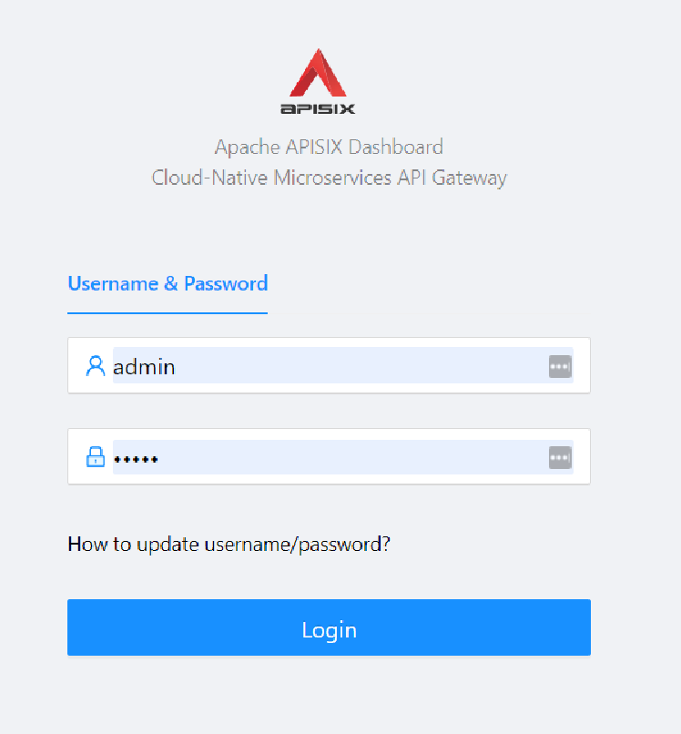

After logging, go to btn:[Route] in the navigation bar on the left side.

In the Route list, we can see the Route we created previously with `curl`.

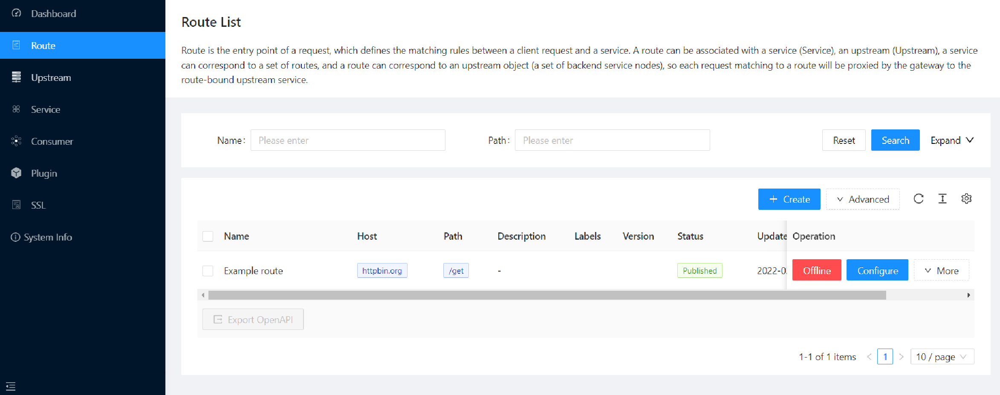

Next, navigate to btn:[Upstream].
Likewise, the Dashboard displays our sample Upstream.

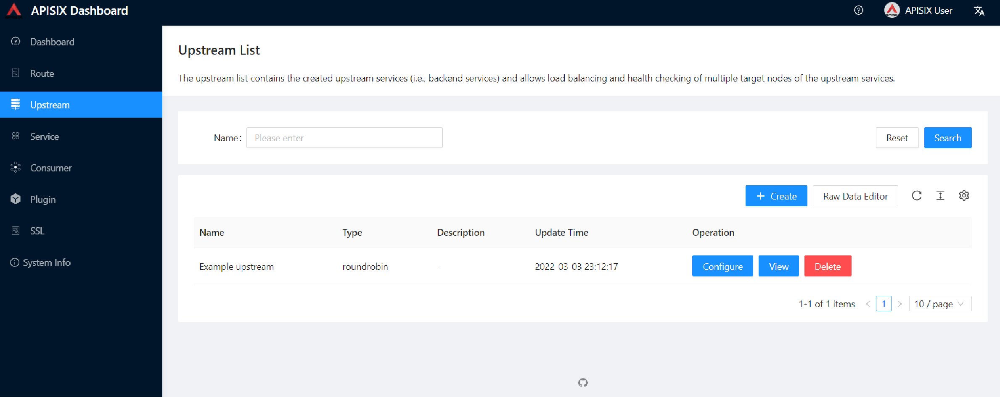

Click on btn:[Create], and give the Consumer a name, e.g., `Example Consumer`.
Click btn:[Next].

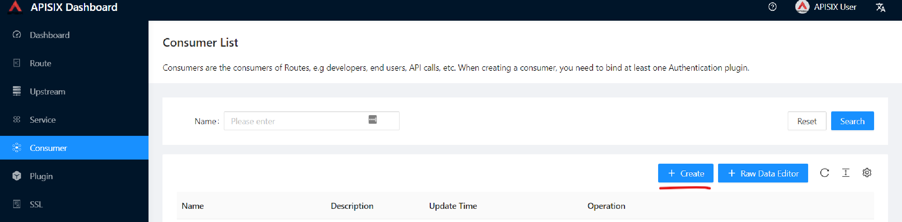

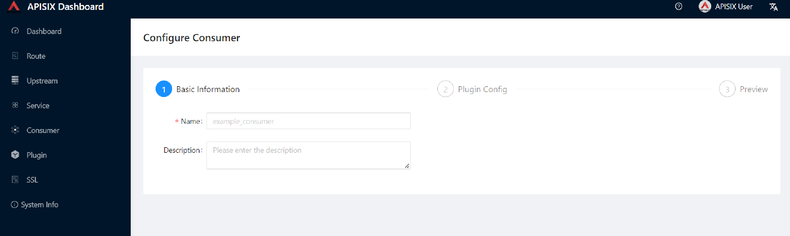

=== Enable key-auth plugin

For this Consumer, we will apply a key authentication.
Among the many plugins available, let's choose `key auth`.

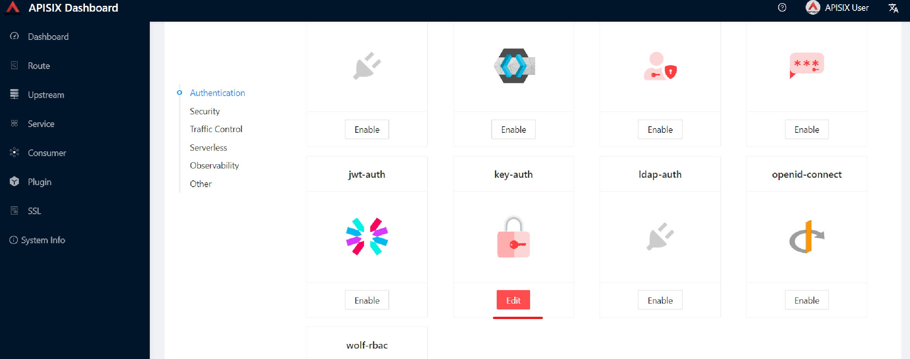

Click btn:[Enable] and push the toggle switch on.
Then, provide a key for the Consumer, _e.g._, `john`.
btn:[Submit], click btn:[Next] and btn:[Submit] again.

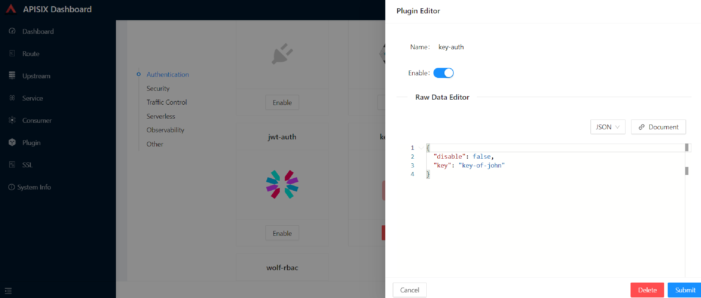

At this point, we should have a ready-to-use Consumer.

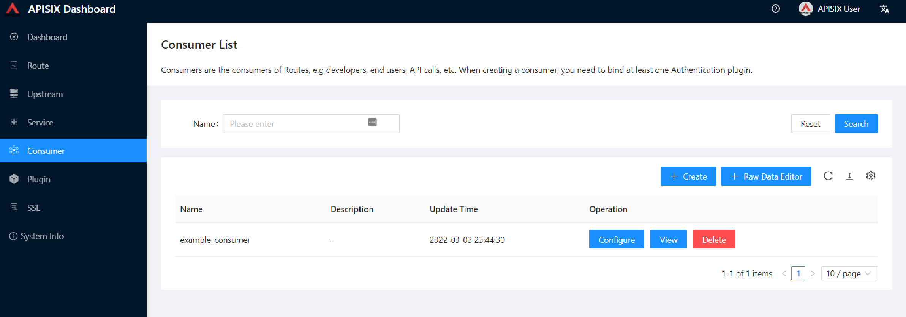

We control the data allowed to transit via the gateway by adding authentication.
We can identify *unique* Consumers accessing our API.
Any request that does not include a valid API key will be rejected with an HTTP `401` status.

To prove it, let's move back to the terminal.

[source,bash]
----
curl -i -X GET "http://127.0.0.1:9080/anything/foo?arg=10" -H "Host: example.com"
----

Because we didn't set the authentication key, Apache APISIX will return an unauthorized error.

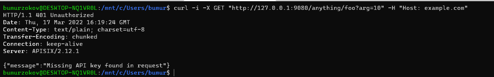

We can retry the same request with the authentication key.

[source,bash]
----
curl -i -X GET http://127.0.0.1:9080/get -H "Host: httpbin.org" -H "apikey: key-of-john"
----

We can now successfully access the endpoint!

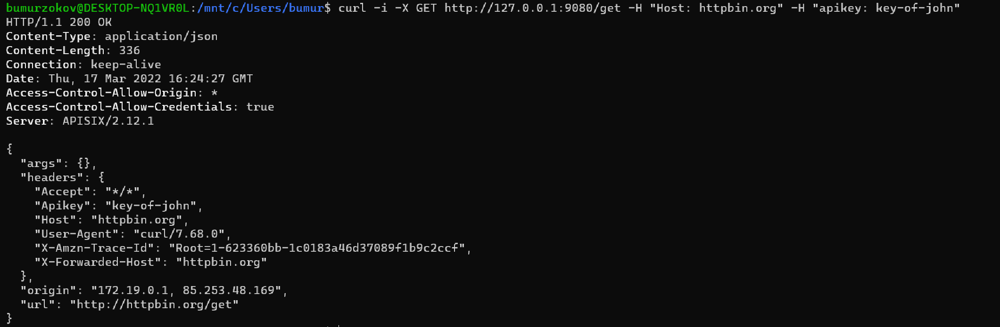

This section shows how to use Apache APISIX to deploy, configure, and securely publish APIs from the Dashboard.

== Plugins Usage

=== JWT Plugin

Apache APISIX API Gateway acts as a single entry point and offers many authentication plugins, including:

* https://apisix.apache.org/docs/apisix/plugins/basic-auth[HTTP Basic Auth^]
* https://apisix.apache.org/docs/apisix/plugins/key-auth[API Keys based Auth^]
* https://apisix.apache.org/docs/apisix/plugins/openid-connect[OpenID Connect^]
* https://apisix.apache.org/docs/apisix/plugins/hmac-auth[HMAC Auth^]
* https://apisix.apache.org/docs/apisix/plugins/ldap-auth[Ldap Authentication^]
* etc.

The https://apisix.apache.org/docs/apisix/plugins/jwt-auth[JWT (JSON Web Token) plugin^] is another solid option for API gateway authentication.
JWT simplifies authentication setup, taking care of the nitty-gritty details.
Please refer to https://jwt.io/[JWT^] for more information.

[INFO]
====
The https://apisix.apache.org/docs/apisix/plugins/jwt-auth[Apache APISIX JWT Plugin] acts as an issuer and also validates the token on behalf of the API.
It means that developers do not have to add any code to process the authentication.
====

[IMPORTANT]
====
We need to disable the `key-auth` plugin we previously enabled to use another authentication plugin.
Disabling is possible via the Dashboard or the CLI.
====

Let's apply the JWT plugin to our existing API.
We update the existing `Consumer` plugin config with JWT-related configuration:

[source,bash]
----
curl http://127.0.0.1:9080/apisix/admin/consumers -H 'X-API-KEY: edd1c9f034335f136f87ad84b625c8f1' -X PUT -d '
{
    "username": "example_consumer",
    "plugins": {
        "jwt-auth": {
            "key": "user-key",
            "secret": "my-secret-key"
        }
    }
}'
----

The response will look something like this:

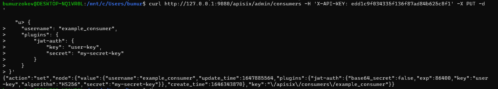

We can now add the `jwt-auth` plugin to the Route we have created previously:

[source,bash]
----

curl http://127.0.0.1:9080/apisix/admin/routes/1 -H 'X-API-KEY: edd1c9f034335f136f87ad84b625c8f1' -X PUT -d '
{
    "methods": ["GET"],
    "uri": "/get",
    "plugins": {
        "jwt-auth": {}
    },
    "upstream_id": "1"
}'
----

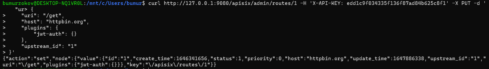

==== Test Plugin

We want to validate that the setup is correct as we did before.

[TIP]
====
`jwt-auth` uses the HS256 algorithm by default.
If you use the RS256 algorithm, you must specify the algorithm and configure the public and private keys.
Please check the https://apisix.apache.org/docs/apisix/plugins/jwt-auth#:~:text=jwt%2Dauth%20uses%20the%20HS256%20algorithm[documentation^] for more details.
====

Run the following command to generate a new JWT token:

[source,bash]
----
curl http://127.0.0.1:9080/apisix/plugin/jwt/sign?key=user-key -i
----

Apache APISIX returns a token:

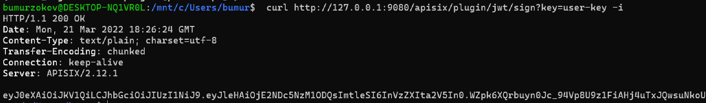

We can use the newly-generated token to authenticate our next request:

[source,bash]
----
curl -i -X GET http://127.0.0.1:9080/get -H 'Authorization: <SET_GENERATED_TOKEN>'
----

Output with token:

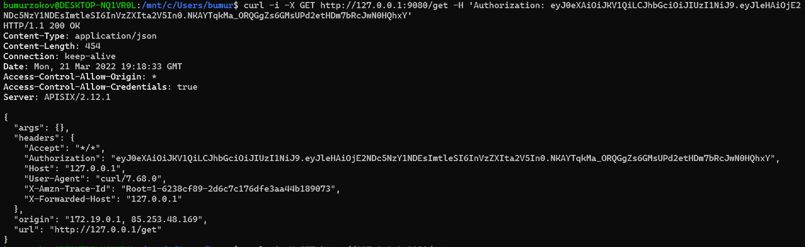

If you try to access the same endpoint without a token in the Header request, you will get HTTP Error _401 Unauthorized:
[source,bash]
----
curl -i -X GET http://127.0.0.1:9080/get
----

Output without token:

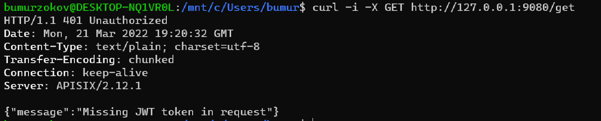

We have validated the client's identity attempting to request by using various https://apisix.apache.org/docs/apisix/plugins/key-auth[authentication plugins] with the help of Apache APISIX.

=== IP Restriction Plugin

In our modern era, API security has become increasingly important.
Many hardening techniques are available:

* TLS encryption
* API Firewalls
* Validating request data
* Throttling for protection
* Continuously monitoring
* Auditing
* Logging

An API Gateway can handle all those cross-cutting concerns.

[INFO]
====
Another technique is to limit the IPs of clients that can send requests.
The https://apisix.apache.org/docs/apisix/plugins/ip-restriction/[Apache APISIX IP Restrictions Plugin^] implements this technique.
If the user tries to send a request from an IP that is not valid, Apache APISIX will meet them with an error.
====

Let's enable `ip-restriction` plugin for our existing _Example route_.

[source,bash]
----
curl http://127.0.0.1:9080/apisix/admin/routes/1 -H 'X-API-KEY: edd1c9f034335f136f87ad84b625c8f1' -X PUT -d '
{
    "uri": "/get",
    "upstream_id": "1",
    "plugins": {
        "ip-restriction": {
            "whitelist": [
                "127.0.0.1",
                "113.74.26.106/24"
            ]
        }
    }
}'
----

Output:

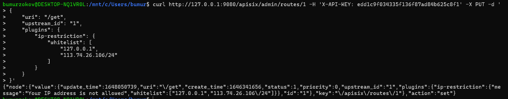

With IP restrictions that allow only specific IP addresses, requests from IP addresses outside of the list are rejected.

[source,bash]
----
curl http://127.0.0.1:9080/get -i --interface 127.0.0.2
----

Output:

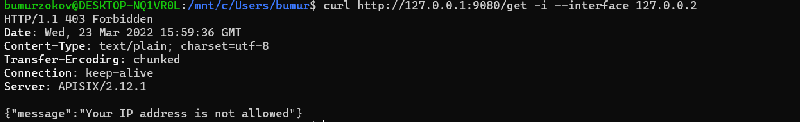

We can not access the API with IPs other than the allowed ones.

[TIP]
====
By default, the plugin returns a generic `{"message":"Your IP address is not allowed"}` if the IP is not allowed.
It's possible to configure a more friendly message via the plugin.
====

In addition, the plugin also provides the ability to disallow IP address ranges.

When wanting to disable a plugin, we can delete the corresponding JSON configuration from the plugin configuration.
*Apache APISIX supports hot reloading*; there's no need to restart the service!

[source,bash]
----
curl http://127.0.0.1:9080/apisix/admin/routes/1 -H 'X-API-KEY: edd1c9f034335f136f87ad84b625c8f1' -X PUT -d '
{
    "uri": "/get",
    "plugins": {},
    "upstream_id": "1"
}'
----

Output:

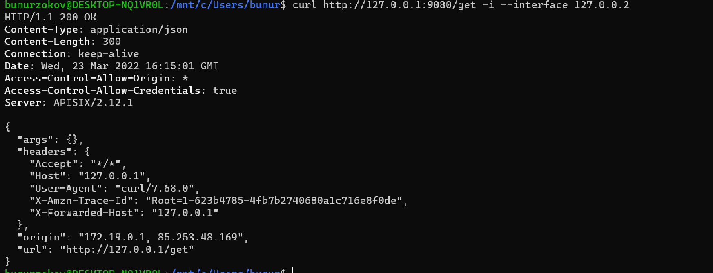

=== Limit Count Plugin

API traffic management can improve the overall visibility of one's system and better understand the state of the traffic throughout one's organization.
A better understanding of the undergoing activities provides many opportunities to solve problems.

With the help of an API Gateway, one can set automatic retries, timeouts, circuit breakers, or rate-limiting.
Rate limiting is a strategy for limiting network traffic. It puts a cap on how often someone can repeat an action within a specific timeframe – for instance, trying to log into an account.

[INFO]
====
The https://apisix.apache.org/docs/apisix/plugins/limit-count/[Limit count plugin^] is one among many limiting plugins.
It limits the request rate by a fixed number of requests in a given time window:
how many HTTP requests one can make in a given period of seconds, minutes, hours, days, months, or years.
====

Let's enable the `limit-count` plugin on our existing Route.
To do so, run the following command:

[source,bash]
----
curl -i http://127.0.0.1:9080/apisix/admin/routes/1 -H 'X-API-KEY: edd1c9f034335f136f87ad84b625c8f1' -X PUT -d '
{
    "uri": "/get",
    "plugins": {
        "limit-count": {
            "count": 2,
            "time_window": 60,
            "rejected_code": 503,
            "key_type": "var",
            "key": "remote_addr"
        }
    },
    "upstream_id": "1"
}'
----

Output:

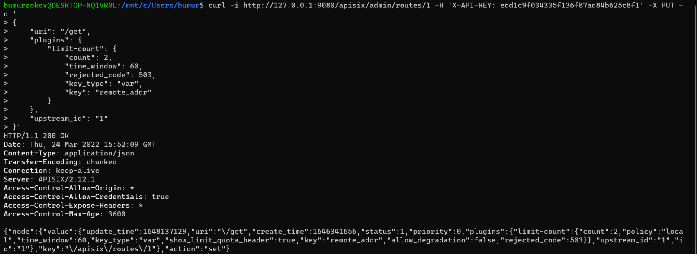

The above configuration limits the number of requests to two in 60 seconds.
Apache APISIX will handle the first two requests as usual:

[source,bash]
----
curl -i http://127.0.0.1:9080/get
----

A third request in the same period will return a 503 HTTP code:

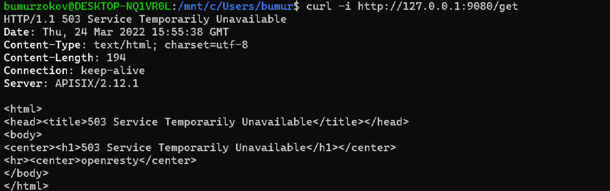

You can configure the failure message with the `rejected_msg` attribute.
For example, we can set it with `Requests are too frequent, please try again later`.
After reaching the threshold, the response is akin to the following:

----
HTTP/1.1 503 Service Temporarily Unavailable
Content-Type: text/html
Content-Length: 194
Connection: keep-alive
Server: APISIX web server

{"error_msg":"Requests are too frequent, please try again later."}
----

[INFO]
====
As usual, You also can complete the above operation through the web interface, first add a route, then add the `limit-count` plugin:

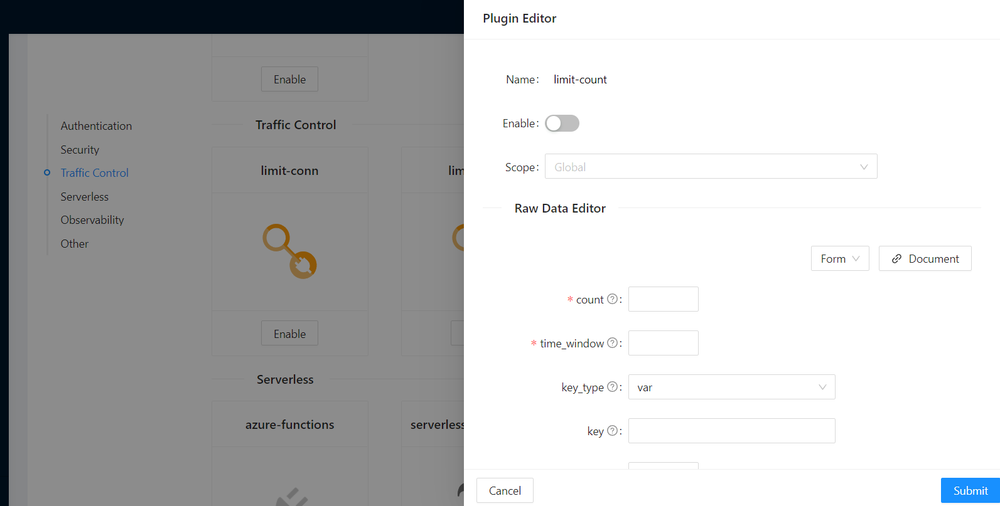

====

=== HTTP Logger Plugin

API observability is the ability to understand system behavior and investigate the interactions between an application's components. It provides for your API tracers, metrics and loggers.

An API event is logged each time an API operation is invoked and for each API event. You can gain analytic insights into your API activities or debug your APIs through the logged data

[INFO]
====
For instance, https://apisix.apache.org/docs/apisix/plugins/http-logger/#how-to-enable[HTTP logger Plugin^]
pushes Log data requests to HTTP/HTTPS servers or sends as JSON objects to Monitoring tools.
====

The following is an example of how to enable the http-logger for our specific route.
You could generate a mock HTTP server at http://mockbin.org/bin/create[mockbin^] to view the logs.

[source,bash]
----
curl http://127.0.0.1:9080/apisix/admin/routes/1 -H 'X-API-KEY: edd1c9f034335f136f87ad84b625c8f1' -X PUT -d '
{
      "plugins": {
            "http-logger": {
                "uri": "http://mockbin.org/bin/5451b7cd-af27-41b8-8df1-282ffea13a61"
            }
       },
      "upstream_id": "1",
      "uri": "/get"
}'
----

You will get the following response:

[source,json]
----
{
  "node": {
    "value": {
      "update_time": 1648189729,
      "uri": "/get",
      "create_time": 1646341656,
      "status": 1,
      "priority": 0,
      "upstream_id": "1",
      "plugins": {
        "http-logger": {
          "include_resp_body": false,
          "timeout": 3,
          "include_req_body": false,
          "concat_method": "json",
          "name": "http logger",
          "auth_header": "",
          "uri": "http://mockbin.org/bin/5451b7cd-af27-41b8-8df1-282ffea13a61",
          "batch_max_size": 1000,
          "max_retry_count": 0,
          "retry_delay": 1,
          "buffer_duration": 60,
          "inactive_timeout": 5
        }
      },
      "id": "1"
    },
    "key": "/apisix/routes/1"
  },
  "action": "set"
}

----

We can send a request to this get endpoint to generate logs.

[source,bash]
----
curl -i http://127.0.0.1:9080/get
----

As you can see, some recent logs are sent to our mock server:

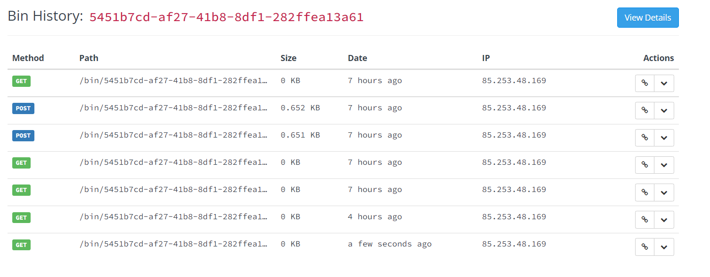

[INFO]
====
You can find information about other Apache APISIX Observability
Plugins https://apisix.apache.org/docs/apisix/plugins/zipkin[here^].
====

