= Hands-on lab Apache APISIX
Bobur Umurzokov <bumurzaqov2@gmail.com>
:toc:
:icons: font
:experimental: true

== Welcome

Welcome to Hands-on lab https://apisix.apache.org/[Apache APISIX^]!
In this session, we will use https://apisix.apache.org/docs/apisix/how-to-build[Apache APISIX on Docker^] to show a couple of nifty features that can help your information system cope with the challenges introduced by APIs.

* Routing your calls to the correct upstream
* Available abstractions: Route, Upstream, Service
* The Apache APISIX dashboard
* Configuring APISIX with the dashboard
* Configuring APISIX with the command-line
* Monitoring APISIX
* Introduction to plugin development in Lua (basics of Lua included)

== Concepts

We should learn a couple of core concepts before Apache APISIX work as per our needs.

. https://apisix.apache.org/docs/apisix/architecture-design/route/[Route^] is the most critical concept in Apache APISIX; it instructs APISIX how to forward traffic to the correct upstream.
. https://apisix.apache.org/docs/apisix/architecture-design/upstream/[Upstream^] is the view of backend microservices from Apache APISIX point of view.
. https://apisix.apache.org/docs/apisix/architecture-design/plugin/[Plugin^] is a mechanism to manage traffic (authentication, authorization, and so on) on the APISIX side.

== Pre-requisites

* Installed https://www.docker.com/[Docker^].
* We use the https://curl.se/docs/manpage.html[curl^] command for API testing.
You can also use other tools such as Postman for testing.

== Install Apache APISIX

Download the Docker image of Apache APISIX workshop example.

[source,bash^]
----
git clone https://github.com/Boburmirzo/apisix-workshop.git
----

Switch the current directory to the apisix-workshop path.

[source,bash^]
----
cd apisix-workshop
----

Run the `docker compose` command to install Apache APISIX.

[source,bash]
----
docker compose -p docker-apisix up -d
----

Once the download is complete, execute the curl command on the host running Docker to access the Admin API, and determine if Apache APISIX was successfully started based on the returned data.

Please execute the curl command on the host where you are running
Docker.

[source,bash]
----
curl "http://127.0.0.1:9080/apisix/admin/services/" -H 'X-API-KEY: edd1c9f034335f136f87ad84b625c8f1'
----

== Create a Route

Now we have a running instance of Apache APISIX. Next, let’s create a
Route.

=== How it works

Apache APISIX is based on a couple of primitives:

* One of them is the https://apisix.apache.org/docs/apisix/architecture-design/route/[Route^]
* Another is the https://apisix.apache.org/docs/apisix/architecture-design/upstream/[Upstream^]

We can create a Route and configure the underlying Upstream. 
When Apache APISIX receives a request matching the Route, it forwards it to the underlying Upstream.

=== Route Configuration

The following command creates a sample Route:

.See the command
[%collapsible]
====
[source,bash]
----
include::../cmds/1_create_route.sh[]
----
====

<1> The configuration of Apache APISIX objects is handled via a REST API
<2> The `/apisix/admin/routes` endpoint manages Routes
<3> Because configuration is a highly critical feature, we need to authenticate via an API key.
Here, we use the default one.
It's highly advised to generate your own, and regularly change it.
To update your Admin API token, please refer to https://apisix.apache.org/docs/apisix/how-to-build#step-5-update-admin-api-token-to-secure-apache-apisix[this guide^].
<4> HTTP method matching the newly-defined route
<5> Host matching the newly-defined route
<6> URI matching the newly-defined route.
Notice the star character:
every URI starting with `/anything/` matches.
<7> Upstream defined at the same time as the Route.
Upstream references a cluster of nodes, which you can balance load across, depending on some algorithm.
Here, we have a single Upstream, so we can use any algorithm.

[INFO]
====
Apache APISIX Admin API provides a RESTful interface for the administration and configuration of Upstreams, Routes, Plugins, and Consumers. All the tasks you can perform against the Gateway can be automated using the https://apisix.apache.org/docs/apisix/admin-api[Admin API].
====

Once we have created the Route, we can check whether it works.
Apache APISIX should forward the request to http://httpbin.org:80/anything/foo?arg=10.

.See the command
[%collapsible]
====
[source,bash]
----
include::../cmds/2_created_route_test.sh[]
----
====

== Create an Upstream

In the previous paragraph, we created a Route that defined its Upstream.
It's also possible to create an Upstream once and reference it in multiple Routes.

Apache APISIX API is consistent.
The Upstream API is similar to the Route's.
With the help of the https://apisix.apache.org/docs/apisix/architecture-design/upstream/[Upstream documentation^] and the command used to create the Route above, create an Upstream with the following properties:

* ID: `1`
* Single node
* The node points to httpbin.org:80

.See the solution
[%collapsible]
====
[source,bash]
----
include::../cmds/3_create_upstream.sh[]
----
====

Also, you can configure the Upstream with additional properties like
health check, retries, retry timeout or load-balancing to multiple systems.

[INFO]
====
You can learn more about other Admin API Upstream request methods
https://apisix.apache.org/docs/apisix/admin-api#:~:text=Back%20to%20TOC-,Upstream,-%23[here^].
====

== Bind the Route to the Upstream

In the above section, we created an Upstream (referencing our backend).
It can be referenced by `upstream_id` in a specific Route or Service.

Now, let's bind a Route for it.

.See the command
[%collapsible]
====
[source,bash]
----
include::../cmds/4_bind_route_to_upstream.sh[]
----
====

In the Route request body, we are specifying following:

<1> Any requests to path `"/get"`
<2> Host that matches domain name `"httpbin.org"`
<3> Will be forwarded to the upstream target (backend service) instead of the host.
For the purposes of our example, the upstream will point to target, _httpbin.org_. In a real environment, the upstream will point to the same service running on multiple systems.

By creating an Upstream object and referencing it by upstream_id in the Route, you can ensure that there is only a single value of the object that needs to be maintained.

=== Validation

At this point, we have created a Route and an Upstream and bound them together.
Now is time to test our configuration.

.See the command
[%collapsible]
====
[source,bash]
----
include::../cmds/5_bind_route_to_upstream_test.sh[]
----
====

It should return the expected data from the configured Upstream.

== APISIX Dashboard

Apache APISIX is the first Open source API gateway, with a built-in low-code Dashboard offering a powerful and flexible interface for developers to use.

The https://github.com/apache/apisix-dashboard[Apache APISIX Dashboard] is designed to make it as easy as possible for users to operate Apache APISIX through a frontend interface.

You can find more information about APISIX Dashboard in the https://apisix.apache.org/docs/dashboard/USER_GUIDE[user guide^].

[TIP]
====
A https://youtu.be/-9-HZKK2ccI[Getting started with Apache APISIX Dashboard^] video tutorial is available.
It demos the same features we achieve here via the +++<abbr title="Command-Line Interface">CLI</abbr>+++.
====

=== Add a new Consumer

We created a new Route, Upstream, and mapped the former to the latter in the above steps.

You can also try to create an Upstream, a Route and map them using the dashboard.

.Try it yourself
[%collapsible]
====

*Create an Upstream*

1. Access your dashboard instance running on the address http://localhost:9000/ and
login with default credentials `admin`/`admin`.
2. Go to *Upstream* > *Upstream List*.
3. Click btn:[Create] to add new Upstream.
4. For this example, enter example_upstream in the *Name* field.
5. Scroll down and in the *Target* field, specify httpbin.org with port 80.
6. Keep other fields as default.
7. Scroll down and click btn:[Next].
8. Review and click btn:[Submit].
9. On the *Upstreams* page, you can see the new upstream service and click btn:[View] to see Raw data of configuration.

*Create a Route and bind it to the upstream from previous steps.*

1. Go to *Route* > *Route List*.
2. Click btn:[Create] to add new Route.
3. Enter example_route in the *Name* field.
4. Scroll down and in the *Path* field, specify URI "/get".
5. In the *HTTP Method* field, keep only GET and remove others.
6. Keep other fields as default.
7. Scroll down and click btn:[Next].
8. In the next page, *Define API Backend Server* section, you can select only example_upstream in the Select Upstream field from dropdown menu.
9. Scroll down and click btn:[Next].
10. No need to enable plugin at this stage, click simply btn:[Next]
11. Review and click btn:[Submit].
12. On the *Routes* page, you can see the new route and click btn:[View] to see Raw data of configuration.

====
[NOTE]
====
We can achieve the same configuration result with the +++<abbr title="Command-Line Interface">CLI</abbr>+++ as with the Dashboard.
Indeed, the Dashboard sends HTTP requests to Apache APISIX.
====

The Route we have created is public.
Thus, anyone can access the underlying Upstream as long as they know the endpoint Apache APISIX exposes to the outside world.
It's not safe as a malicious actor could use this endpoint.
For this reason, we are going to add authentication to the Route.

Apache APISIX dashboard is running on the address http://localhost:9000/.
You can navigate to this address and see the Dashboard running.

The default credentials are `admin`/`admin`.

[.text-center]
image::login-dashboard-screenshot.png[]

After logging, go to btn:[Route] in the navigation bar on the left side.

In the Route list, we can see the Route we created previously with `curl`.

image::route-list-screenshot.png[]

Next, navigate to btn:[Upstream].
Likewise, the Dashboard displays our sample Upstream.

image::upstream-list-screenshot.png[]

First, we will enable `key-auth` plugin for the route. To do that:

Navigate to btn:[Route], click btn:[Configure] and skip
*Define API Backend Server* section and open *Plugin Config*

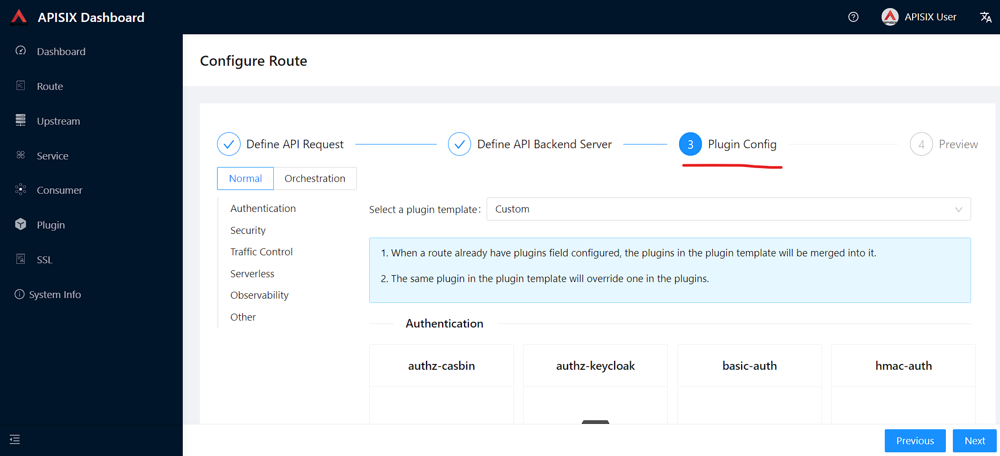

In this section, you can find `key-auth` plugin and click btn:[Enable].
Request raw data you can keep as empty and push the toggle switch on.

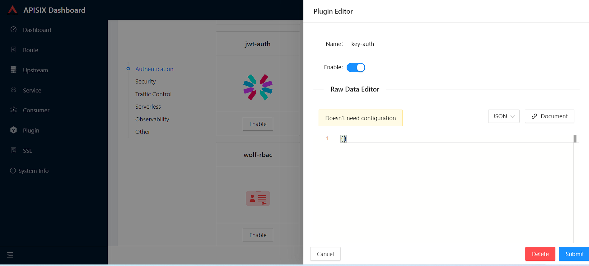

Then press btn:[Submit] to save changes, click btn:[Next] and after btn:[Submit]
to update route configs.

Second, go to btn:[Consumer] page from the navigation bar and click on btn:[Create], then give the Consumer a name, e.g., `Example Consumer`.
Click btn:[Next].

image::create-new-consumer-screenshot.png[]

image::consumer-detail-screenshot.png[]

=== Enable key-auth plugin

For this Consumer, we will apply a key authentication.
Among the many plugins available, let's choose `key auth`.

image::key-auth-plugin-enable-screenshot.png[]

Click btn:[Enable] and push the toggle switch on.
Then, provide a key for the Consumer, _e.g._, `john`.
btn:[Submit], click btn:[Next] and btn:[Submit] again.

Raw JSON data for Plugin editor config:

[source,json5]
----
{
  "key": "key-of-john"
}
----

image::plugin-config-example-screenshot.png[]

At this point, we should have a ready-to-use Consumer.

image::example-consumer-created-screenshot.png[]

We control the data allowed to transit via the gateway by adding authentication.
We can identify *unique* Consumers accessing our API.
Any request that does not include a valid API key will be rejected with an HTTP `401` status.

To prove it, let's move back to the terminal and run below curl command.

.See the command
[%collapsible]
====
[source,bash]
----
include::../cmds/6_authentication_enable_failed_test.sh[]
----
====

Because we didn't set the authentication key, Apache APISIX will return an unauthorized error.

Response:

[source,json5]
----
HTTP/1.1 401 Unauthorized
Date: Sun, 27 Mar 2022 15:18:15 GMT
Content-Type: text/plain; charset=utf-8
Transfer-Encoding: chunked
Connection: keep-alive
Server: APISIX/2.12.1

{"message":"Missing API key found in request"}
----

We can retry the same request with the authentication key.

.See the command
[%collapsible]
====
[source,bash]
----
include::../cmds/7_authentication_enable_success_test.sh[]
----
====

We can now successfully access the endpoint!

[source,json5]
----
HTTP/1.1 200 OK
Content-Type: application/json
Content-Length: 330
Connection: keep-alive
Date: Sun, 27 Mar 2022 15:22:27 GMT
Access-Control-Allow-Origin: *
Access-Control-Allow-Credentials: true
Server: APISIX/2.12.1

{
"args": {},
"headers": {
"Accept": "*/*",
"Apikey": "key-of-john",
"Host": "127.0.0.1",
"User-Agent": "curl/7.68.0",
"X-Amzn-Trace-Id": "Root=1-62408133-62400aae5dea7be428a89f8b",
"X-Forwarded-Host": "127.0.0.1"
},
"origin": "172.19.0.1, 85.253.48.169",
"url": "http://127.0.0.1/get"
}
----

Above section showed how to use Apache APISIX to deploy, configure, and securely publish APIs from the Dashboard.

== Plugins Usage

=== JWT Plugin

Apache APISIX API Gateway acts as a single entry point and offers many authentication plugins, including:

* https://apisix.apache.org/docs/apisix/plugins/basic-auth[HTTP Basic Auth^]
* https://apisix.apache.org/docs/apisix/plugins/key-auth[API Keys based Auth^]
* https://apisix.apache.org/docs/apisix/plugins/openid-connect[OpenID Connect^]
* https://apisix.apache.org/docs/apisix/plugins/hmac-auth[HMAC Auth^]
* https://apisix.apache.org/docs/apisix/plugins/ldap-auth[Ldap Authentication^]
* etc.

The https://apisix.apache.org/docs/apisix/plugins/jwt-auth[JWT (JSON Web Token) plugin^] is another solid option for API gateway authentication.
JWT simplifies authentication setup, taking care of the nitty-gritty details.
Please refer to https://jwt.io/[JWT^] for more information.

[INFO]
====
The https://apisix.apache.org/docs/apisix/plugins/jwt-auth[Apache APISIX JWT Plugin] acts as an issuer and also validates the token on behalf of the API.
It means that developers do not have to add any code to process the authentication.
====

[IMPORTANT]
====
We need to disable the `key-auth` plugin we previously enabled to use another authentication plugin.
Disabling is possible via the Dashboard or the CLI.

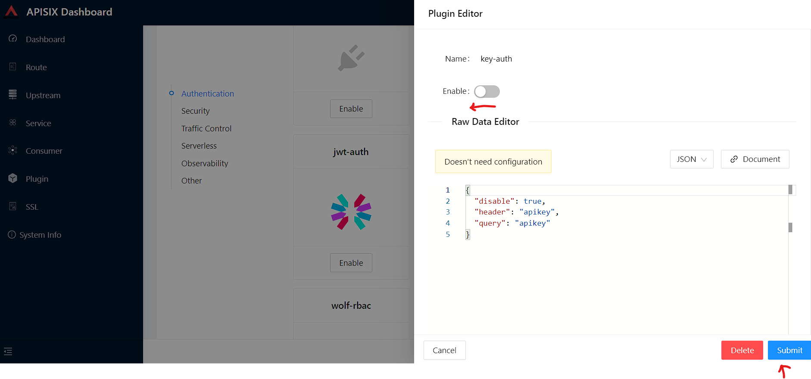
====

Let's apply the JWT plugin to our existing API.
We update the existing `Consumer` plugin config with JWT-related configuration:

.See the command
[%collapsible]
====
[source,bash]
----
include::../cmds/8_update_consumer_jwt_credentials.sh[]
----
====

The response will look something like this:

[source,json5]
----
{
  "node": {
    "key": "/apisix/consumers/example_consumer",
    "value": {
      "create_time": 1649158467,
      "username": "example_consumer",
      "update_time": 1649163154,
      "plugins": {
        "jwt-auth": {
          "base64_secret": false,
          "secret": "my-secret-key",
          "algorithm": "HS256",
          "key": "user-key",
          "exp": 86400
        }
      }
    }
  },
  "action": "set"
}
----

We can now add the `jwt-auth` plugin to the Route we have created previously:

.See the command
[%collapsible]
====
[source,bash]
----
include::../cmds/8_add_jwt_plugin_to_route.sh[]
----
====

Response:

[source,json5]
----
{
  "node": {
    "key": "/apisix/routes/1",
    "value": {
      "upstream_id": "1",
      "uri": "/get",
      "create_time": 1648567195,
      "status": 1,
      "id": "1",
      "plugins": {
        "jwt-auth": {}
      },
      "priority": 0,
      "methods": [
        "GET"
      ],
      "update_time": 1649163340
    }
  },
  "action": "set"
}

----

==== Test Plugin

We want to validate that the setup is correct as we did before.

[TIP]
====
`jwt-auth` uses the HS256 algorithm by default.
If you use the RS256 algorithm, you must specify the algorithm and configure the public and private keys.
Please check the https://apisix.apache.org/docs/apisix/plugins/jwt-auth#:~:text=jwt%2Dauth%20uses%20the%20HS256%20algorithm[documentation^] for more details.
====

First, you need to set up the route for the API that signs the token, which will use the https://apisix.apache.org/docs/apisix/plugins/public-api/[public-api^] plugin.

.See the command
[%collapsible]
====
[source,bash]
----
include::../cmds/8_jwt_plugin_enable_public-api-plugin.sh[]
----
====

Response:

[source,json5]
----
{
  "action": "set",
  "node": {
    "key": "/apisix/routes/jas",
    "value": {
      "status": 1,
      "priority": 0,
      "id": "jas",
      "update_time": 1649490287,
      "plugins": {
        "public-api": {}
      },
      "uri": "/apisix/plugin/jwt/sign",
      "create_time": 1649490287
    }
  }
}
----

Then, run the following command to generate a new JWT token:

.See the command
[%collapsible]
====
[source,bash]
----
include::../cmds/8_jwt_plugin_generate_token.sh[]
----
====

Apache APISIX returns a token:

[source,text]
----
HTTP/1.1 200 OK
Date: Tue, 05 Apr 2022 12:57:34 GMT
Content-Type: text/plain; charset=utf-8
Transfer-Encoding: chunked
Connection: keep-alive
Server: APISIX/2.12.1

<GENERATED_TOKEN>
----

We can use the newly-generated token to authenticate our next request:

.See the command
[%collapsible]
====
[source,bash]
----
include::../cmds/8_jwt_plugin_in_use.sh[]
----
====

Output with token:

[source,text]
----
HTTP/1.1 200 OK
Content-Type: application/json
Content-Length: 454
Connection: keep-alive
Date: Tue, 05 Apr 2022 13:02:30 GMT
Access-Control-Allow-Origin: *
Access-Control-Allow-Credentials: true
Server: APISIX/2.12.1
----

If you try to access the same endpoint without a token in the Header request, you will get HTTP Error _401 Unauthorized:

.See the command
[%collapsible]
====
[source,bash]
----
include::../cmds/8_jwt_plugin_failure_example.sh[]
----
====

Output without token:

[source,json5]
----
{ "message": "Missing JWT token in request" }
----

We have validated the client's identity attempting to request by using various https://apisix.apache.org/docs/apisix/plugins/key-auth[authentication plugins] with the help of Apache APISIX.

[TIP]
====
A https://youtu.be/kbELyQIXAsw[Centralized Authentication with Apache APISIX Plugins^] video tutorial describes different authentication methods, overviews the use-cases and benefits of centralized authentication with Apache APISIX API Gateway and you will learn how to configure common authentication plugins like basic, key, and JWT to protect your services.
====

=== IP Restriction Plugin

In our modern era, API security has become increasingly important.
Many hardening techniques are available:

* TLS encryption
* API Firewalls
* Validating request data
* Throttling for protection
* Continuously monitoring
* Auditing
* Logging

An API Gateway can handle all those cross-cutting concerns.

[INFO]
====
Another technique is to limit the IPs of clients that can send requests.
The https://apisix.apache.org/docs/apisix/plugins/ip-restriction/[Apache APISIX IP Restrictions Plugin^] implements this technique.
If the user tries to send a request from an IP that is not valid, Apache APISIX will meet them with an error.

Single IPs, multiple IPs or ranges in https://en.wikipedia.org/wiki/Classless_Inter-Domain_Routing#CIDR_notation[CIDR^] notation like 10.10.10.0/24 can be used. The plugin supports IPv4 and IPv6 addresses.
====

Let's enable `ip-restriction` plugin for our existing _Example route_.

[source,bash]
----
curl http://127.0.0.1:9080/apisix/admin/routes/1 -H 'X-API-KEY: edd1c9f034335f136f87ad84b625c8f1' -X PUT -d '
{
    "uri": "/get",
    "upstream_id": "1",
    "plugins": {
        "ip-restriction": {
            "whitelist": [
                "127.0.0.1"
            ]
        }
    }
}'
----

Output:

image::ip-restrictions-enable-plugin-screenshot.png[]

With IP restrictions that allow only specific IP addresses, requests from IP addresses outside the list are rejected.

[source,bash]
----
curl http://127.0.0.1:9080/get -i --interface 127.0.0.2
----

Output:

image::ip-restrictions-plugin-test-result-screenshot.png[]

We can not access the API with IPs other than the allowed ones.

[TIP]
====
By default, the plugin returns a generic `{"message":"Your IP address is not allowed"}` if the IP is not allowed.
It's possible to configure a more friendly message via the plugin.
====

In addition, the plugin also provides the ability to disallow IP address ranges.

When wanting to disable a plugin, we can delete the corresponding JSON configuration from the plugin configuration.
*Apache APISIX supports hot reloading*; there's no need to restart the service!

[source,bash]
----
curl http://127.0.0.1:9080/apisix/admin/routes/1 -H 'X-API-KEY: edd1c9f034335f136f87ad84b625c8f1' -X PUT -d '
{
    "uri": "/get",
    "plugins": {},
    "upstream_id": "1"
}'
----

Output:

image::ip-restrictions-plugin-test-result-disabled-screenshot.png[]

[INFO]
====
There are other security plugins are offered by Apache APISIX too.

- **https://apisix.apache.org/docs/apisix/plugins/cors[CORS^]** – Enable https://developer.mozilla.org/en-US/docs/Web/HTTP/CORS[CORS^] easily to allow developers to make requests from the browser.
- **https://apisix.apache.org/docs/apisix/plugins/uri-blocker[URI Blocker^]** (_uri-blocker_)–  Intercepts user requests and blocks uri resources.
- **https://apisix.apache.org/docs/apisix/plugins/consumer-restriction[Consumer Restriction^]** (_consumer-restriction_) – makes corresponding access restrictions to your services or routes based on different users selected.
- **https://apisix.apache.org/docs/apisix/plugins/csrf[CSRF^]** – Based on the Double Submit Cookie way, protects your API from CSRF attacks.
====

=== Limit Count Plugin

API traffic management can improve the overall visibility of one's system and better understand the state of the traffic throughout one's organization.
A better understanding of the undergoing activities provides many opportunities to solve problems.

With the help of an API Gateway, one can set automatic retries, timeouts, circuit breakers, or rate-limiting.
Rate limiting is a strategy for limiting network traffic. It puts a cap on how often someone can repeat an action within a specific timeframe – for instance, trying to log into an account.

[INFO]
====
The https://apisix.apache.org/docs/apisix/plugins/limit-count/[Limit count plugin^] is one among many limiting plugins.
It limits the request rate by a fixed number of requests in a given time window:
how many HTTP requests one can make in a given period of seconds, minutes, hours, days, months, or years.
====

Let's enable the `limit-count` plugin on our existing Route.
To do so, run the following command:

[source,bash]
----
curl -i http://127.0.0.1:9080/apisix/admin/routes/1 -H 'X-API-KEY: edd1c9f034335f136f87ad84b625c8f1' -X PUT -d '
{
    "uri": "/get",
    "plugins": {
        "limit-count": {
            "count": 2,
            "time_window": 60,
            "rejected_code": 503,
            "key_type": "var",
            "key": "remote_addr"
        }
    },
    "upstream_id": "1"
}'
----

Output:

[source,text]
----
HTTP/1.1 200 OK
Date: Sun, 08 May 2022 10:50:40 GMT
Content-Type: application/json
Transfer-Encoding: chunked
Connection: keep-alive
Server: APISIX/2.13.1
Access-Control-Allow-Origin: *
Access-Control-Allow-Credentials: true
Access-Control-Expose-Headers: *
Access-Control-Max-Age: 3600

{"action":"set","node":{"value":{"update_time":1652007040,"id":"1","status":1,"create_time":1648567195,"priority":0,"uri":"\/get","plugins":{"limit-count":{"allow_degradation":false,"time_window":60,"show_limit_quota_header":true,"rejected_code":503,"policy":"local","count":2,"key":"remote_addr","key_type":"var"}},"upstream_id":"1"},"key":"\/apisix\/routes\/1"}}
----

The above configuration limits the number of requests to *two in 60 seconds*.
Apache APISIX will handle the first two requests as usual:

[source,bash]
----
curl -i http://127.0.0.1:9080/get
----

A third request in the same period will return a 503 HTTP code:

[source,text]
----
HTTP/1.1 503 Service Temporarily Unavailable
Date: Sun, 08 May 2022 10:51:02 GMT
Content-Type: text/html; charset=utf-8
Content-Length: 194
Connection: keep-alive
Server: APISIX/2.13.1

<html>
<head><title>503 Service Temporarily Unavailable</title></head>
<body>

<h1>503 Service Temporarily Unavailable</h1>

openresty

</body>
</html>
----

You can configure the failure HTTP Status `403 Forbidden` by configuring `rejected_code` and message with the `rejected_msg` attributes.
For example, we can set it with `Requests are too frequent, please try again later`.
After reaching the threshold, the response is akin to the following:

.See the example with custom rejection message:
[%collapsible]
====
[source,bash]
----
curl -i http://127.0.0.1:9080/apisix/admin/routes/1 -H 'X-API-KEY: edd1c9f034335f136f87ad84b625c8f1' -X PUT -d '
{
    "uri": "/get",
    "plugins": {
        "limit-count": {
            "count": 2,
            "time_window": 60,
            "rejected_code": 403,
            "rejected_msg": "Requests are too frequent, please try again later.",
            "key_type": "var",
            "key": "remote_addr"
        }
    },
    "upstream_id": "1"
}'
----
====

Result:

[source,text]
----
HTTP/1.1 403 Forbidden
Date: Sun, 08 May 2022 11:30:43 GMT
Content-Type: text/plain; charset=utf-8
Transfer-Encoding: chunked
Connection: keep-alive
Server: APISIX/2.13.1

{"error_msg":"Requests are too frequent, please try again later."}
----

[INFO]
====
As usual, You also can complete the above operation through the web interface, first add a route, then add the `limit-count` plugin:

image::limit-count-plugin-enable-with-dashboard-screenshot.png[]

====

=== HTTP Logger Plugin

API observability is the ability to understand system behavior and investigate the interactions between an application's components. It provides for your API tracers, metrics and loggers.

The core of API observability breaks down into three key areas: structured logs, metrics, and traces. Let’s break down each pillar and learn how with Apache APISIX Plugins we can simplify these tasks.

Logs are also easy to instrument and trivial step of API observability.
An API event is logged each time an API operation is invoked. You can gain analytic insights into your API activities or debug your APIs through the logged data

[INFO]
====
For instance, https://apisix.apache.org/docs/apisix/plugins/http-logger/#how-to-enable[HTTP logger Plugin^]
pushes Log data requests to HTTP/HTTPS servers or sends as JSON objects to Monitoring tools.
====

The following is an example of how to enable the http-logger for our specific route.
You could generate a mock HTTP server at http://mockbin.org/bin/create[mockbin^] to view the logs.

To http-logger settings, we can just put our mock server uri address like below:

[source,json5]
----
{"uri": "http://mockbin.org/bin/5451b7cd-af27-41b8-8df1-282ffea13a61"}
----

.See the command
[%collapsible]
====
[source,bash]
----
include::../cmds/9_http_logger_plugin_enable.sh[]
----
====

You will get the following response:

[source,json5]
----
{
  "node": {
    "value": {
      "update_time": 1648189729,
      "uri": "/get",
      "create_time": 1646341656,
      "status": 1,
      "priority": 0,
      "upstream_id": "1",
      "plugins": {
        "http-logger": {
          "include_resp_body": false,
          "timeout": 3,
          "include_req_body": false,
          "concat_method": "json",
          "name": "http logger",
          "auth_header": "",
          "uri": "http://mockbin.org/bin/5451b7cd-af27-41b8-8df1-282ffea13a61",
          "batch_max_size": 1000,
          "max_retry_count": 0,
          "retry_delay": 1,
          "buffer_duration": 60,
          "inactive_timeout": 5
        }
      },
      "id": "1"
    },
    "key": "/apisix/routes/1"
  },
  "action": "set"
}

----

We can send a request to this get endpoint to generate logs.

[source,bash]
----
curl -i http://127.0.0.1:9080/get
----

Next, access your mock server logs and check logs

[source,http request]
----
https://mockbin.org/bin/5451b7cd-af27-41b8-8df1-282ffea13a61/log
----

As you can see, some recent logs are sent to our mock server:

image::http-logger-plugin-test-screenshot.png[]

=== Prometheus plugin

API monitoring is the process of collecting and analyzing data about the performance of an API to identify problems that impact users. If an application is running slowly, you must first understand the cause before you can correct it.

Metrics are a numeric representation of data measured over intervals of time. You can also aggregate this data into daily or weekly frequency and run queries against a distributed system like Elasticsearch. Or sometimes based on metrics you trigger alerts to take any action later. Once API metrics are collected, you can track them with metrics tracking tools such as Prometheus.

[INFO]
====
https://apisix.apache.org/docs/apisix/plugins/prometheus/[Prometheus plugin^]
can fetch API metrics data and you can show metrics exported by the plugin in https://grafana.com/[Grafana^].
====

Let's enable `prometheus` plugin for our route:

[source,bash]
----
curl http://127.0.0.1:9080/apisix/admin/routes/1  -H 'X-API-KEY: edd1c9f034335f136f87ad84b625c8f1' -X PUT -d '
{
    "uri": "/get",
    "plugins": {
        "prometheus":{}
    },
    "upstream_id": "1"
}'
----

[NOTE]
====
When set _prefer_name_ to true in the request attribute, it will print route/service name instead of id in Prometheus metric.
====

Response:

[source,json5]
----
{
  "node": {
    "value": {
      "update_time": 1648206467,
      "uri": "/get",
      "create_time": 1646341656,
      "status": 1,
      "priority": 0,
      "plugins": {
        "prometheus": {
          "prefer_name": false
        }
      },
      "upstream_id": "1",
      "id": "1"
    },
    "key": "/apisix/routes/1"
  },
  "action": "set"
}
----

We fetch the metric data from the specified url `/apisix/prometheus/metrics`.

[source,bash]
----
curl -i http://127.0.0.1:9091/apisix/prometheus/metrics
----

You will get response with Prometheus metrics something like below:

[source,text]
----
HTTP/1.1 200 OK
Server: openresty
Date: Fri, 25 Mar 2022 11:13:14 GMT
Content-Type: text/plain; charset=utf-8
Transfer-Encoding: chunked
Connection: keep-alive

# HELP apisix_batch_process_entries batch process remaining entries
# TYPE apisix_batch_process_entries gauge
apisix_batch_process_entries{name="http logger",route_id="1",server_addr="172.19.0.8"} 0
# HELP apisix_etcd_modify_indexes Etcd modify index for APISIX keys
# TYPE apisix_etcd_modify_indexes gauge
apisix_etcd_modify_indexes{key="consumers"} 17819
apisix_etcd_modify_indexes{key="global_rules"} 17832
apisix_etcd_modify_indexes{key="max_modify_index"} 20028
apisix_etcd_modify_indexes{key="prev_index"} 18963
apisix_etcd_modify_indexes{key="protos"} 0
apisix_etcd_modify_indexes{key="routes"} 20028
apisix_etcd_modify_indexes{key="services"} 0
apisix_etcd_modify_indexes{key="ssls"} 0
apisix_etcd_modify_indexes{key="stream_routes"} 0
apisix_etcd_modify_indexes{key="upstreams"} 7342
apisix_etcd_modify_indexes{key="x_etcd_index"} 20033

...
----

And we can also check the status of our endpoint at Prometheus dashboard by pointing to this
URL `http://localhost:9090/targets`

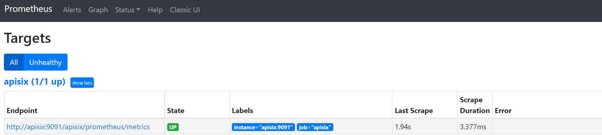

As you can see, Apache APISIX exposed metrics endpoint is upon and running.

Now you can query metrics for `apisix_http_status` to see what http requests are handled by API Gateway and what was outcome.

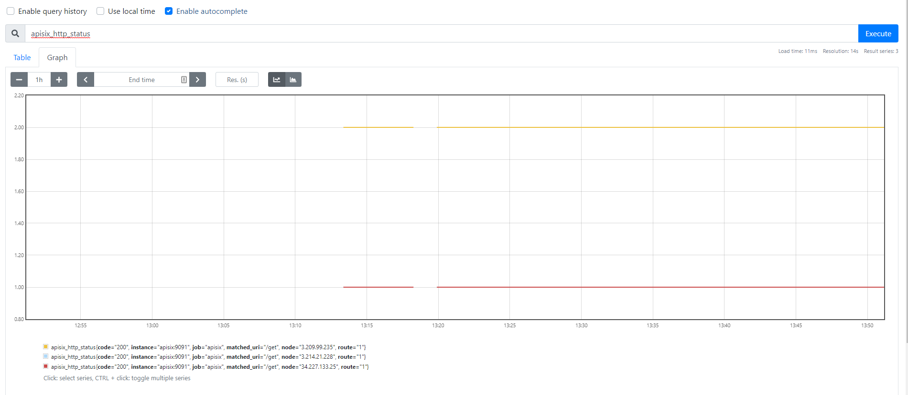

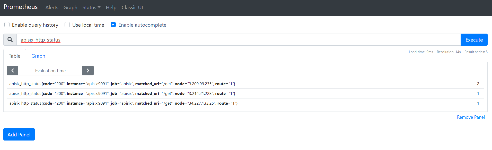

[NOTE]
====
Metrics exported by the plugin can be visualized in Grafana using a drop in https://grafana.com/grafana/dashboards/11719[Apache APISIX Grafana Dashboard Template^]
====

In addition to this, you can view Grafana dashboard running in your local instance. Go to `http://localhost:3000/`

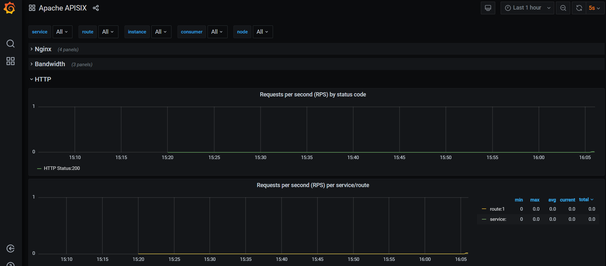

Behind the scene, Apache APISIX downloads https://github.com/apache/apisix/blob/master/docs/assets/other/json/apisix-grafana-dashboard.json[Grafana dashboard meta], imports it to Grafana and fetches real time metrics from Prometheus plugin.

=== Zipkin Plugin

The third observability pillar is a tracing or distributed tracing allows you to understand the life of a request as it traverses your service network allows you to answer questions like
what service has this request touched and how much latency was introduced.

Traces enable you to further explore which logs to look at for a particular session or related set of API calls.

[INFO]
====
https://github.com/openzipkin/zipkin[Zipkin^] an open source distributed tracing system. https://apisix.apache.org/docs/apisix/plugins/zipkin[APISIX Zipkin plugin^] is supported to collect tracing and report to Zipkin Collector based on https://zipkin.io/pages/instrumenting.html[Zipkin API specification^].
====

Here's an example to enable the `zipkin plugin` on the specified route:

[source,bash]
----
curl http://127.0.0.1:9080/apisix/admin/routes/1  -H 'X-API-KEY: edd1c9f034335f136f87ad84b625c8f1' -X PUT -d '
{
    "methods": ["GET"],
    "uri": "/get",
    "plugins": {
        "zipkin": {
            "endpoint": "http://127.0.0.1:9411/api/v2/spans",
            "sample_ratio": 1
        }
    },
    "upstream_id": "1"
}'
----

Successful response looks like below:

[source,json5]
----
{
  "node": {
    "key": "/apisix/routes/1",
    "value": {
      "upstream_id": "1",
      "status": 1,
      "create_time": 1646341656,
      "uri": "/get",
      "methods": [
        "GET"
      ],
      "update_time": 1648558131,
      "id": "1",
      "plugins": {
        "zipkin": {
          "endpoint": "http://127.0.0.1:9411/api/v2/spans",
          "span_version": 2,
          "server_addr": "<your-local-ip-address>",
          "service_name": "APISIX",
          "sample_ratio": 1
        }
      },
      "priority": 0
    }
  },
  "action": "set"
}
----

We can test our example by simple running the following command:

[source,bash]
----
curl -i http://127.0.0.1:9080/get
----

Response:
[source,json5]
----
HTTP/1.1 200 OK
Content-Type: application/json
Content-Length: 469
Connection: keep-alive
Date: Thu, 31 Mar 2022 10:03:26 GMT
Access-Control-Allow-Origin: *
Access-Control-Allow-Credentials: true
Server: APISIX/2.13.0

{
  "args": {},
  "headers": {
    "Accept": "*/*",
    "Host": "127.0.0.1",
    "User-Agent": "curl/7.68.0",
    "X-Amzn-Trace-Id": "Root=1-62457c6e-0dc0ed5b49ccc6fc7956dc2e",
    "X-B3-Parentspanid": "61bd3f4046a800e7",
    "X-B3-Sampled": "1",
    "X-B3-Spanid": "855cd5465957f414",
    "X-B3-Traceid": "e18985df47dab632d62083fd96626692",
    "X-Forwarded-Host": "127.0.0.1"
  },
  "origin": "172.19.0.1, 85.253.48.169",
  "url": "http://127.0.0.1/get"
}
----

As you can see, there are some additional trace identifiers (like traceId, spanId, parentId) were appended to the headers:

[source,text]
----
    "X-B3-Parentspanid": "61bd3f4046a800e7",
    "X-B3-Sampled": "1",
    "X-B3-Spanid": "855cd5465957f414",
    "X-B3-Traceid": "e18985df47dab632d62083fd96626692",
----

Then you can use a browser to access http://127.0.0.1:9411/zipkin, see traces on the Web UI of Zipkin

[IMPORTANT]
====
You need to run the Zipkin instance in order to install Zipkin Web UI.
For example, by using docker you can simply run it:

[source,curl]
----
docker run -d -p 9411:9411 openzipkin/zipkin
----
====

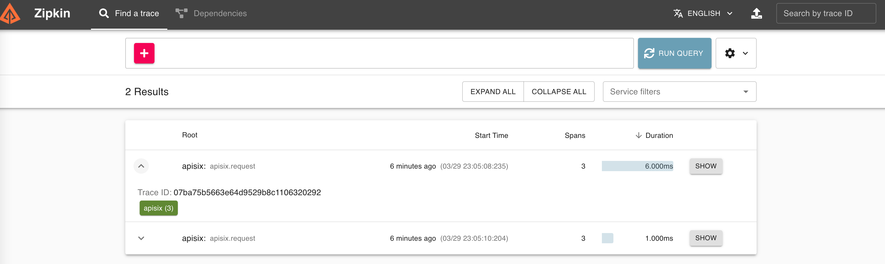

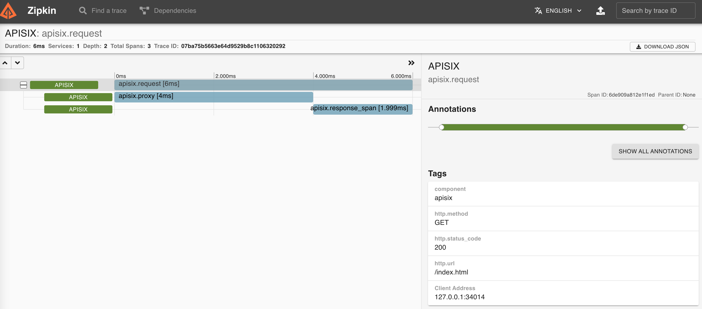

[INFO]
====
You can find information about other Apache APISIX Observability
Plugins https://apisix.apache.org/docs/apisix/plugins/zipkin[here^].
====

[TIP]
====
A https://youtu.be/XK0xcui5BQU[APIs Observability with Apache APISIX Plugins^] video tutorial presents the power of some observability Plugins and takes a look at how to set up these plugins, how to use them to understand API behavior, and later solve problems that impact our users.
====

=== Serverless Plugin

Serverless is a cloud-native development model that allows developers to build and run applications without having to manage servers. It provides all the continually updated infrastructure and resources needed to run your applications.

Apache APISIX provides support for serverless frameworks for popular cloud vendors such as https://azure.microsoft.com/en-in/services/functions/[Azure Functions^]

[INFO]
====
https://apisix.apache.org/docs/apisix/plugins/azure-functions[Azure Functions Serverless Plugin^] lets the users define an upstream to the Azure HTTP Trigger based Function with the combination of other request plugins to secure, manage Azure functions as a dynamic upstream to proxy all requests for a particular URI.
====

We are assuming your https://docs.microsoft.com/en-us/azure/azure-functions/functions-bindings-http-webhook-trigger?tabs=in-process%2Cfunctionsv2&pivots=programming-language-csharp[HTTP Trigger Function^] is deployed in Azure and ready to be served.
Please, follow the tutorial to https://docs.microsoft.com/en-us/azure/azure-functions/functions-create-function-app-portal[create your first function in the Azure portal^]

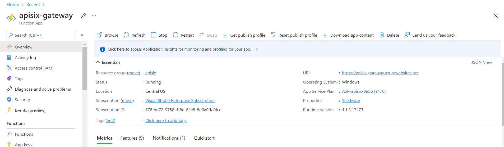

For the purpose of demo, the Function app is running on this address
`https://apisix-gateway.azurewebsites.net/`

[NOTE]
====
We need to only enable https://portal.azure.com/#@OnOffAppOU.onmicrosoft.com/resource/subscriptions/178fbd72-9758-4f8e-84e5-8d0a0ffa0fcd/resourcegroups/apisix/providers/Microsoft.Web/sites/apisix-gateway/functionsList[apisix-gateway^] HttpTrigger function from Azure Portal.
====

Let's run the following cmd to enable `azure-functions` plugin for the route:

[source,bash]
----
curl http://127.0.0.1:9080/apisix/admin/routes/1 -H 'X-API-KEY: edd1c9f034335f136f87ad84b625c8f1' -X PUT -d '
{
    "plugins": {
        "azure-functions": {
            "function_uri": "http://apisix-gateway.azurewebsites.net/api/HttpTrigger",
            "authorization": {
                "apikey": "<Generated API key to access the Azure-Function>"
            }
        }
    },
    "uri": "/azure"
}'
----

Response:

[source,json5]
----
{
  "node": {
    "key": "/apisix/routes/1",
    "value": {
      "plugins": {
        "azure-functions": {
          "keepalive_timeout": 60000,
          "timeout": 3000,
          "authorization": {
            "apikey": "<Generated API key to access the Azure-Function>"
          },
          "keepalive": true,
          "function_uri": "http://apisix-gateway.azurewebsites.net/api/HttpTrigger",
          "ssl_verify": true,
          "keepalive_pool": 5
        }
      },
      "status": 1,
      "id": "1",
      "priority": 0,
      "update_time": 1648290716,
      "uri": "/azure",
      "create_time": 1646341656
    }
  },
  "action": "set"
}

----

Now any requests (HTTP/1.1, HTTPS, HTTP2) to URI `/azure` on the Apache APISIX gateway will trigger an HTTP based function For example ( here Azure Cloud Function just take the name query param and returns Hello $name):

[source,bash]
----
curl -i -XGET http://localhost:9080/azure\?name=APISIX
----

Output:

[source,text]
----
HTTP/1.1 200 OK
Content-Type: text/plain; charset=utf-8
Transfer-Encoding: chunked
Connection: keep-alive
Date: Sat, 26 Mar 2022 10:39:18 GMT
Request-Context: appId=cid-v1:d936efd3-f2ad-43dd-86bd-360a0cde6cf8
Server: APISIX/2.12.1

Hello, APISIX. This HTTP triggered function executed successfully.
----

As we reviewed, the plugin can invoke Azure Functions and supports authorization to Azure cloud service via API keys and https://azure.microsoft.com/en-us/services/active-directory/[Azure active directory^].

[TIP]
====
More about the Apache APISIX Azure function plugin, you can read on https://apisix.apache.org/blog/2021/12/01/apisix-supports-azure-functions/[this blog post^].
====

=== Plugin Orchestration

Sometimes your service requires you to use many plugins together or create custom plugins in addition to Apache Apisix provides. Plugin orchestration is a form of low-code that can help enterprises automate development.

[INFO]
====
With the plugin orchestration capability in the low-code API gateway Apache APISIX, we can easily orchestrate 50+ plugins in a “drag-and-drop” way.
====

In the Apache APISIX Dashboard's, Plugin config web interface lists the currently available plugins and drawing boards, and we can drag and drop the plugins onto the drawing boards to arrange them.

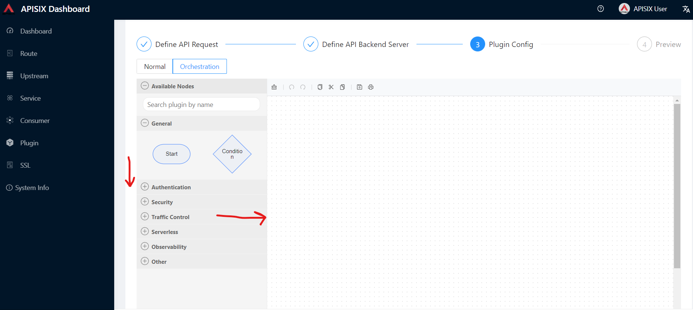

[TIP]
====
More about the Apache APISIX plugin orchestration you can read on this https://apisix.apache.org/blog/2021/07/27/use-of-plugin-orchestration-in-apache-apisix/[blog post^]
====

Let's think of new scenario where we decide the subsequent API request processing logic based on the processing result of previous plugin:

1. Our API receives requests only from whitelisted IPs with the `ip-restriction` plugin control.
2. If the IP is in the whitelist, `limit-count` takes over and limits
the number of requests 2 within 60 seconds time window.
3. If new request comes from different IP range, the plugin returns a 403 (requested resource is forbidden) HTTP status code.

After putting all building blocks to the drawing board (plugins, condition),
we will have a diagram similar to below:

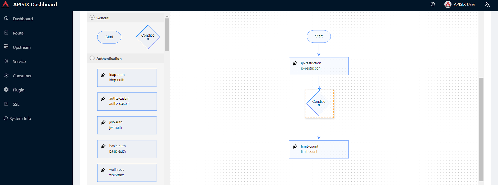

We need to also configure a rule for our condition like `code == 403` for negative case, if the request from unknown IP address. Double-click btn:[Condition] and new _Configure Rule_
pop-up menu appears.

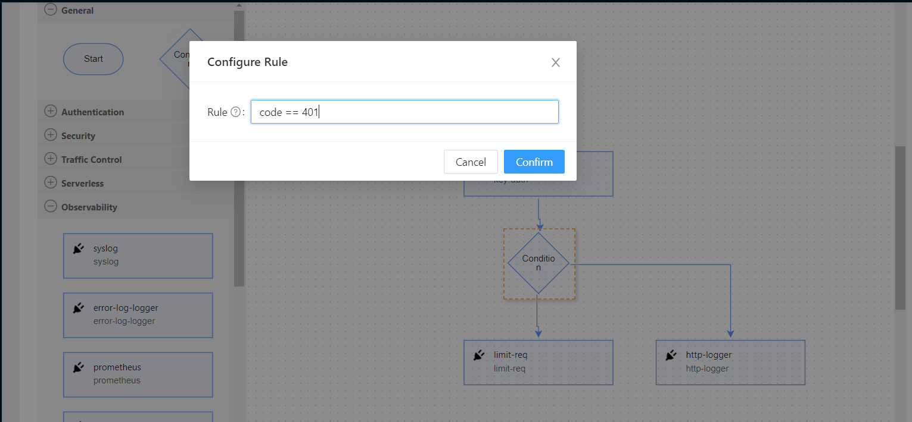

You can fill in `ip-restriction` plugin config the following details in the Plugin Editor. Double-click on btn:[ip-restriction], apply config and click btn:[Submit].

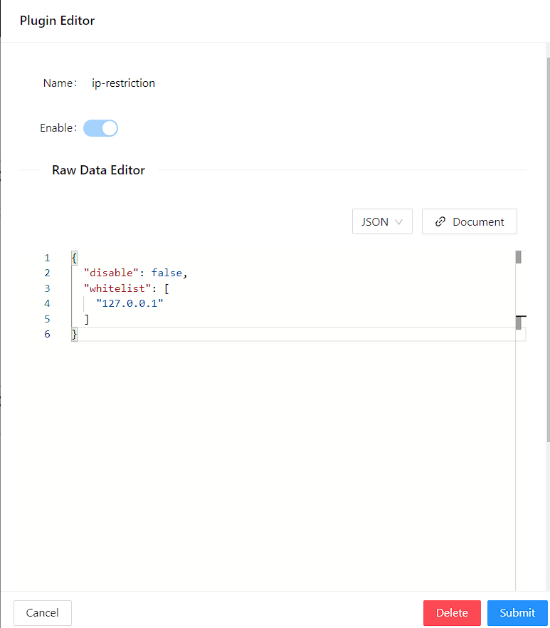

Similarly to `limit-count`:

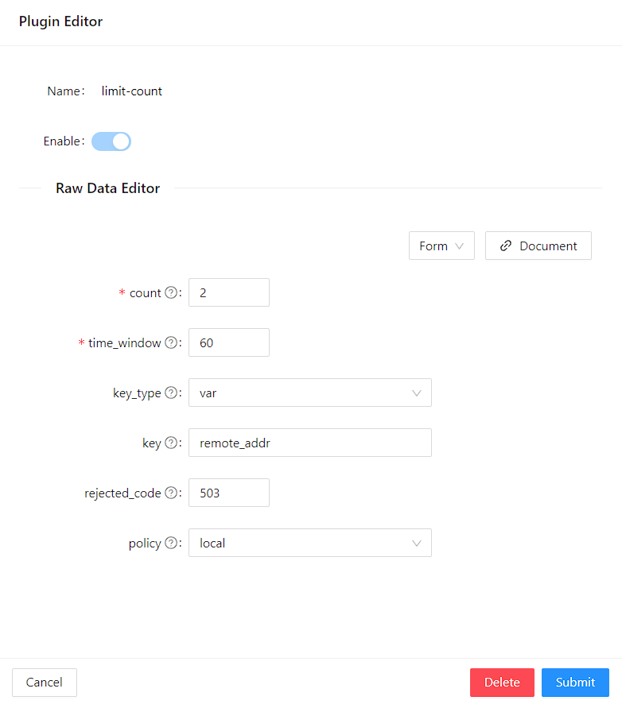

Finally, click btn:[Next] and btn:[Submit] the changes applied on the route.

=== Plugin Development

During technological selection in a project implementation, the most important consideration for the development team is whether the chosen product matches the team’s technology stack or not. Apache APISIX has been supporting customized plugins since the day it was born.

A plugin is an important mechanism in APISIX API Gateway by using it, we can create high-performance systems under tight deadlines. With Apache APISIX we can write custom plugins in a programming language we are familiar with, including Lua, Python, Java, Go, PHP and more.

[INFO]
====
In this demo, we will see simple example of a plugin development in Lua.
For other languages, please review the documentation on https://apisix.apache.org/docs/apisix/external-plugin/[External Plugins^]
====

Let's create new file-logger custom plugin. Users can use the file-logger plug-in to append JSON-formatted request and response data to log files, or push the Log data stream to a specified location given in the path.

Below the whole process of new plugin creation:

* *Step 1.* Go to `/apisix-config` folder to modify `config.yaml`
* *Step 2.* Setup `extra_lua_path` path to load our own plugin code. Add below line to
under `apisix:` section in the config file:

[source,yaml]
----
apisix:
 ...
 extra_lua_path: "/opt/?.lua"
----

[NOTE]
====
Please note if there is another existing plugin with the same name, new custom plugin code will be loaded instead of the built-in one, and you can use this way to override the builtin behavior if needed.
====

* *Step 3.* In the same `config.yaml` file under `plugins` section, you can see all enabled plugins specified by their names:

[source,yaml]
----
plugins:
  - http-logger
  - ip-restriction
  - jwt-auth
  - key-auth
  - limit-conn
  - limit-count
  .....
  - files-logger // To enable our custom plugin, we add the plugin name to the end of list.

----

* *Step 4.* Next we create the `file-logger.lua` file in the apisix-workshop/file-logger-plugin/src directory
and write a code to print as an output the plug-in configuration data and request-related data information to the APISIX `error.log` file. You can use the following code to log:

[source,lua]
----
core.log.warn(core.json.encode(conf))
core.log.warn("ctx: ", core.json.encode(ctx, true))
----

The source code is located in `custom-plugin` folder in the project.

.See the `file-logger.lua` plugin source code
[%collapsible]
====

[source,text]
----
local core         =   require("apisix.core") <1>

local plugin_name = "file-logger" <2>

local schema = { <3>
    type = "object",
    properties = {
        path = {
            type = "string"
        },
    },
    required = {"path"}
}

local _M = { <4>
    version = 1.0,
    priority = 100,
    name = plugin_name,
    schema = schema,
}

function _M.check_schema(conf) <5>
    local ok, err = core.schema.check(schema, conf)
    if not ok then
        return false, err
    end

    return true
end

function _M.log(conf, ctx) <6>
    core.log.warn("conf: ", core.json.encode(conf))
    core.log.warn("ctx: ", core.json.encode(ctx, true))
end

return _M

----
<1> Import apisix core library to reuse built-in methods for the plugin schema validation, printing logs and encoding the input to JSON format.
<2> Set a name of new custom plugin and later we pass the name to plugin config field.
<3> Define plugin properties, in our case we have single required param _path_ where we command to plugin to create a log file in the given path.
<4> _M is very important field in APISIX plugin development which affect the plugin's behavior. There, we can assign plugin version, name, priority, schema and other metadata information.
<5> We override and implement the check_schema(conf) method to complete the plugin specification verification. Core library has provided the public method "core.schema.check", which can be used directly to complete JSON verification as well.
We can also write our custom logic to validate the schema.
<6> The code section shows how to implement any logic relevant to the plugin in the log phase and print some logs. Here, the _conf_ parameter is the relevant configuration information of the plugin, you can use _core.log.warn(core.json.encode(conf))_ to output it to _error.log_ for viewing. And the _ctx_ parameter caches data information related to the request. You can use _core.log.warn(core.json.encode(ctx, true))_ to output it to _error.log_ for viewing

IMPORTANT: Before you introduce new plugin, always determine firstly its name and priority of the plugin. The priority of the new plugin cannot be same to any existing ones.
Plugins with higher priority value will be executed first in a given phase.

====

* *Step 5.* In the project root, open `docker-compose.yml` file and add the following volume info to mount `files-logger` plugin source code to docker:

[source,yaml]
----
volumes:
  - ./apisix_log:/usr/local/apisix/logs
  - ./apisix_conf/config.yaml:/usr/local/apisix/conf/config.yaml:ro
  - ./file-logger-plugin/src:/opt/apisix/plugins:ro
----

* *Step 6.* Enable the plugin for the route and test.

Up to now, we have already prepared `example_upstream` locally.
We can setup new route with our new plugin enabled.

.See the command
[%collapsible]
====
[source,bash]
----
include::../cmds/14_custom_file_logger_plugin_enable.sh[]
----
====

Then you will see a status code of 200 with the response, indicating that the route has been successfully created.

.See the response
[%collapsible]
====
[source,json5]
----
{
  "action": "set",
  "node": {
    "value": {
      "upstream_id": "1",
      "uri": "/get",
      "priority": 0,
      "plugins": {
        "file-logger": {
          "path": "logs/file.log"
        }
      },
      "update_time": 1649529440,
      "status": 1,
      "methods": [
        "GET"
      ],
      "create_time": 1648567195,
      "id": "1"
    },
    "key": "/apisix/routes/1"
  }
}
----
====

In the `apisix_log/error.log` file there will be a record likely below in JSON format:

[source,text]
----
ctx: {"conf_type":"route","conf_version":21998,"conf_id"
.....
conf: {"path":"logs\/file.log"} while logging request
.....
----

It can be seen that the path: `logs/file.log` we configured for the plugin as the conf parameter has been successfully saved. So far we have successfully created a minimal usable plugin that prints the data for the conf and ctx parameters in the log phase.

[TIP]
====
We can directly run `apisix reload` command to reload the latest plugin code without restarting Apache APISIX.
====

You can also try to write core functionality for the custom `file-logger` plugin,
where the program can get the log output path from conf param, create/update the file with new logs.
Please refer to https://apisix.apache.org/docs/apisix/plugin-develop/[Apache APISIX Plug-in Development Guide^] and https://www.tutorialspoint.com/lua/lua_file_io.htm[Lua's IO library^] to learn how to implement it.

.See the full solution
[%collapsible]
====
[source,lua]
----
include::../custom-plugin/file-logger-full-solution.lua[]
----
====

[INFO]
====
With Apache APISIX, you can also write tests to validate the behaviour of plugins.
Please navigate to https://apisix.apache.org/docs/apisix/internal/testing-framework/[APISIX Testing Framework] for more details.
====
